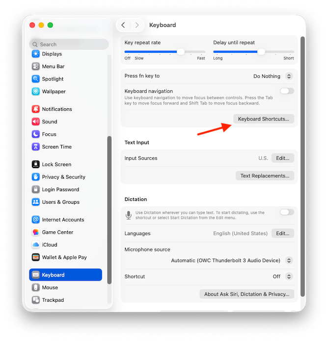
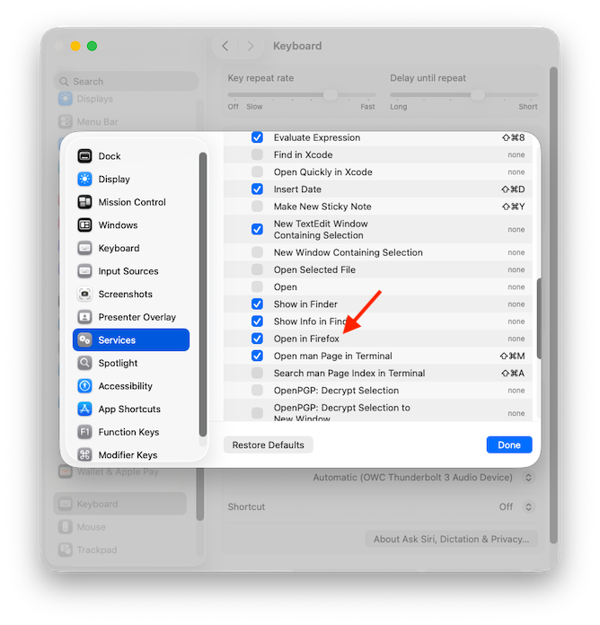

# Browser_service
macOS menu contextual command to open a URL in Firefox, for Safari Users

It lives in the **Services** submenu of the Safari's first menu, and also under services in Safari’s contextual menu.

## To Build:

* You can get a built copy of `BrowserService.service` in a .zip file from the [Releases](https://github.com/DavidPhillipOster/Browser_service/releases) section of this github project. Version 1 is built as a "Fat binary" so it will work on either Intel or Apple Silicon Macs.

* Open the Xcode project and in the Info panel of the BrowserService target change the `com.example` prefix of the bundle Identifier from `com.example.${PRODUCT_NAME:rfc1034identifier}`  to a domain you control.

* You may choose to adjust how the code is signed, but that isn't necessary.

* In Xcode, choose **Build** from the **Product** menu

## To Install:

* If you built it from source: from the **Products** group in Xcode's **Product Navigator** select  `BrowserService.service` and right-click to **Show in Finder** In the Finder, put   `BrowserService.service` in your `Library/Services` directory.

* If you downloaded the .zip from [Releases](https://github.com/DavidPhillipOster/Browser_service/releases), double-click on the zip for the Finder to extract `BrowserService.service` and place it in your `Library/Services` directory.

(Hold to the Option key on the Finder's 'Go' menu to find your Library folder.)

* In **Settings** > **Keyboard** > **Keyboard Shortcuts** > **Services** in the **Text** section check the checkbox to enable **Open in Firefox**. Click on the right edge of its table row to add a command-key-equivalent.

and

## To Use:

In Safari, select a link then choose **Open in Firefox** from **Services** submenu of the right-click menu. You could assign a command key equivalent to make it even easier.

## To Customize:

Currently, this opens Safari links in Firefox. If you want to open them in, for example, Chrome: 
1.) Change the `BrowserService.service` `Contents` folder, change `Info.plist`  `Services User Data` where it says `org.mozilla.firefox` change that to: `com.google.Chrome` and in `Info.plist`  `Services`, change: These two occorences of Firefox to Chrome. 

`"Open links in Firefox";`

`"Open in Firefox";`

## License

• Apache license version 2

